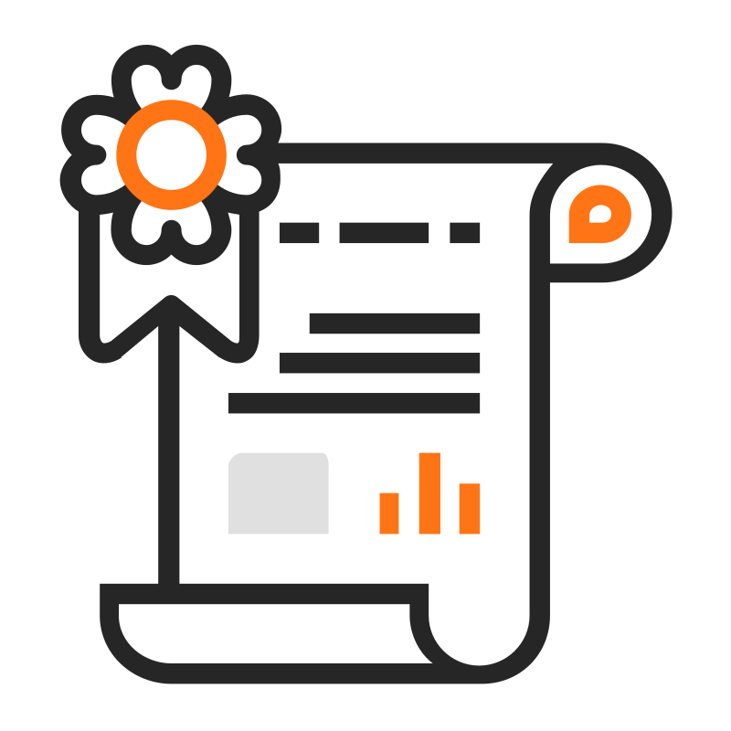

<section class="section" style="max-width: 720px; margin: auto;">
  

    

      <h1>Contact Me</h1>
      
Let’s connect and create something impactful.

    

    

      <ul style="list-style: none; padding-left: 0;">
        <li style="margin-bottom: 0.5rem;">
          
          <strong>Email:</strong> <a href="mailto:sach7411.uae@gmail.com">sach7411.uae@gmail.com</a>
        </li>
        <li style="margin-bottom: 0.5rem;">
          
          <strong>LinkedIn:</strong> <a href="https://www.linkedin.com/in/sachin-mca/" target="_blank">linkedin.com/in/sachin-mca</a>
        </li>
        <li style="margin-bottom: 0.5rem;">
          
          <strong>Portfolio:</strong> <a href="https://sachin-suresh.github.io/sa-portfolio/" target="_blank">sachin-suresh.github.io/sa-portfolio/</a>
        </li>
      </ul>
    

    

      If you’d like to collaborate, hire me, or request custom samples — I’m open to remote roles and documentation consulting.
    

  

</section>
